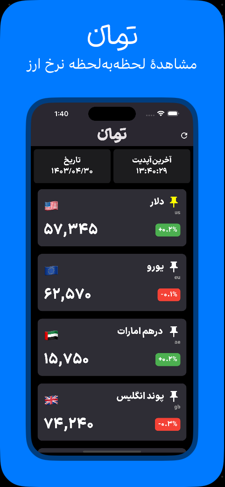

# Toman

   

## Overview
Toman is a mobile application developed using Dart. It provides real-time currency conversion rates, focusing primarily on the value of Toman against other global currencies. The app fetches data from [TGJU](https://www.tgju.org/currency) to ensure up-to-date and accurate exchange rates.

## Installation
The app can be installed on both Android and iOS devices. Follow the steps below to install the app on your device.

### Android
1. Visit the [Releases](#releases) section.
2. Download the `.apk` file.
3. Open the file to install the app on your Android device. You may need to allow installation from unknown sources.

### iOS
1. Download the `.ipa` file from the [Releases](#releases) section.
2. Use the [Sideloadly](https://sideloadly.io/) app to install the `.ipa` on your iOS device.

## Screenshot

   

## Releases
You can download the latest version of the app for Android and iOS from the links below:
- [Releases](#releases)

## Contact
Mahdiyar Salavati - [mahdiyarultra@gmail.com](mailto:mahdiyarultra@gmail.com)

